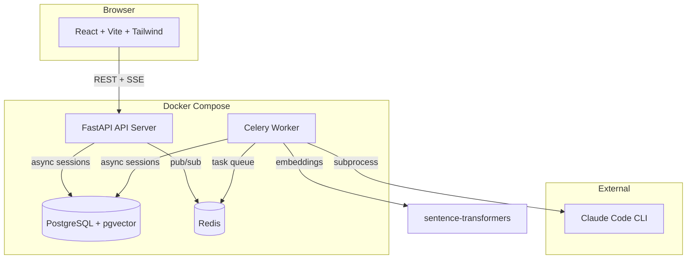
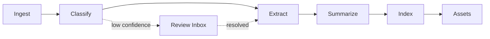

# StudyAIO

[](https://github.com/alcybersec/StudyAIO/actions/workflows/ci.yml)

A local-first, fully dockerized AI study workspace that turns raw university lecture files (PDF, DOCX, PPTX) into organized, searchable, exam-ready study materials.

## Features

- **6-stage processing pipeline** — Ingest, classify, extract, summarize, index, and generate study assets automatically via Celery task chains
- **Smart classification** — AI identifies course code, week number, and title from file contents; routes low-confidence results to a review inbox
- **Rich summaries** — Generates structured markdown summaries with key concepts, definitions, code examples, and exam topics per course week
- **Semantic search & Q&A** — Ask questions about your lectures with source citations backed by pgvector embeddings
- **Flashcards & quizzes** — Auto-generated flashcards with flip/shuffle and MCQ/short-answer quizzes with scoring
- **Real-time progress** — SSE-powered pipeline progress tracking in the browser
- **Review inbox** — Human-in-the-loop for low-confidence AI decisions with suggestion buttons and manual override

## Architecture



### Pipeline Flow



## Tech Stack

| Layer | Technology |
|-------|-----------|
| Backend | Python 3.12, FastAPI, Celery, SQLAlchemy 2.0 (async), Alembic |
| Frontend | React 18, TypeScript, Vite, Tailwind CSS v4, React Query, React Router |
| Database | PostgreSQL 16 + pgvector |
| Queue | Redis 7 |
| Embeddings | sentence-transformers (all-MiniLM-L6-v2) |
| AI Runtime | Claude Code CLI via agent adapter pattern |
| Infrastructure | Docker Compose |
| Testing | pytest (212 unit + 28 integration tests), pytest-asyncio |

## Prerequisites

- Docker & Docker Compose
- [Claude Code CLI](https://docs.anthropic.com/en/docs/claude-code) installed on the host machine

### Claude CLI Setup

The processing pipeline uses Claude Code CLI for AI tasks (classification, summarization, flashcard/quiz generation). The CLI binary and credentials are bind-mounted from the host into the worker container.

```bash
# 1. Install Claude Code CLI (if not already installed)
npm install -g @anthropic-ai/claude-code

# 2. Login — opens browser for OAuth authentication
claude

# This creates ~/.claude/.credentials.json which the worker container needs.
```

If your Claude binary is not at `~/.local/bin/claude`, set `CLAUDE_CLI_PATH` in `.env`:

```bash
# Find your Claude binary
which claude

# Add to .env
CLAUDE_CLI_PATH=/usr/local/bin/claude    # macOS (npm global)
CLAUDE_CLI_PATH=~/.npm-global/bin/claude # custom npm prefix
```

## Quick Start

```bash
# Clone the repository
git clone https://github.com/alcybersec/StudyAIO.git
cd StudyAIO

# Copy environment configuration
cp .env.example .env

# Login to Claude CLI (required for AI pipeline stages)
claude

# Start all services
docker compose up -d

# Run database migrations
make migrate

# Access the application
# UI:  http://localhost:3001
# API: http://localhost:8000
# Docs: http://localhost:8000/docs
```

## Development

```bash
make up          # Start all Docker services
make down        # Stop all services
make test        # Run all backend tests
make migrate     # Run Alembic migrations
make shell       # Open bash in API container
make db          # Open psql shell
make logs        # Tail all service logs
```

## Testing

```bash
# Run all unit tests
make test

# Run specific test modules
docker compose exec api pytest tests/unit/pipeline -v
docker compose exec api pytest tests/unit/api -v

# Stop on first failure
docker compose exec api pytest tests/unit -x -v
```

## Project Structure

```
studyaio/
├── services/
│   ├── app/                    # FastAPI + Celery backend
│   │   ├── app/
│   │   │   ├── api/            # REST endpoints (17 routes)
│   │   │   ├── agents/         # AI adapter pattern
│   │   │   ├── extractors/     # PDF/DOCX/PPTX parsers
│   │   │   ├── models/         # SQLAlchemy ORM (9 models)
│   │   │   ├── pipeline/       # Celery task stages (6)
│   │   │   └── services/       # Business logic layer
│   │   ├── prompts/            # Jinja2 AI prompt templates
│   │   └── tests/              # 240 tests (unit + integration)
│   └── ui/                     # React frontend (7 pages)
│       └── src/
│           ├── pages/          # Dashboard, Course, Week, Upload, Q&A, Review, Settings
│           ├── components/     # Reusable UI components
│           ├── hooks/          # React Query + SSE hooks
│           └── api/            # Typed API client
├── infra/
│   ├── docker-compose.yml
│   └── db/init.sql
├── docs/
│   ├── PRD.md                  # Product requirements
│   ├── PROGRESS.md             # Milestone tracker
│   └── api.md                  # API reference
└── .github/workflows/ci.yml   # GitHub Actions CI
```
