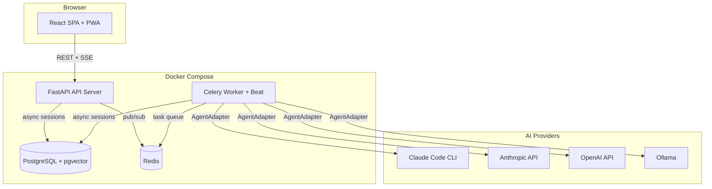
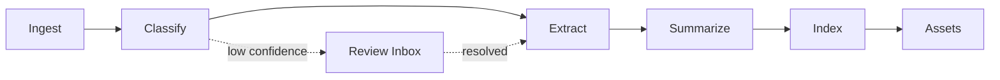

# StudyAIO

[](https://github.com/alcybersec/StudyAIO/actions/workflows/ci.yml)

A local-first, fully dockerized AI study workspace that turns raw university lecture files (PDF, DOCX, PPTX) into organized, searchable, exam-ready study materials.

**v2:** 39 models, 137 API endpoints, 20 pages, 1942 tests (1484 backend + 394 frontend unit + 64 E2E).

## Features

**Core Pipeline**
- **6-stage processing pipeline** — Ingest, classify, extract, summarize, index, and generate study assets automatically via Celery task chains
- **Smart classification** — AI identifies course code, week number, and title; routes low-confidence results to a review inbox
- **Rich summaries** — Structured markdown with key concepts, definitions, code examples, and exam topics per course week
- **Semantic search & Q&A** — Ask questions about lectures with source citations backed by pgvector embeddings

**Study Tools**
- **Flashcards with SM-2** — Spaced repetition algorithm, flip/shuffle, per-card ease tracking
- **Quiz engine** — MCQ and short-answer with scoring, attempt history
- **Exam mode** — Create exams with deadlines, auto-schedule study plans, track weak topics
- **Timed study** — Pomodoro-style study sessions with automatic session recording
- **AI chat** — Multi-turn RAG conversation with streaming responses
- **Knowledge graph** — AI-extracted concepts with D3 force-directed visualization

**Platform**
- **Multi-AI provider** — Claude Code CLI, Anthropic API, OpenAI, Ollama (switchable at runtime)
- **Auth & multi-tenant** — JWT + HttpOnly cookies, Argon2id, TOTP MFA, OAuth (Google/GitHub), magic links
- **Billing** — Stripe integration with free/pro tiers and usage quotas
- **Gamification** — XP, levels, achievements, daily challenges, leaderboard
- **Notifications** — Email, Telegram bot, Web Push (VAPID)
- **Calendar sync** — Google Calendar bidirectional sync with Celery beat
- **Analytics** — Study heatmap, retention curves, mastery breakdown, exam readiness
- **PWA** — Offline support with IndexedDB queue, install prompt
- **Dark mode** — CSS custom property theming with system preference detection
- **Cloud ready** — S3 storage backend, Traefik reverse proxy, AWS Terraform, CI/CD

## Architecture



### Pipeline Flow



## Tech Stack

| Layer | Technology |
|-------|-----------|
| Backend | Python 3.12, FastAPI, Celery, SQLAlchemy 2.0 (async), Alembic |
| Frontend | React 19, TypeScript, Vite, Tailwind CSS v4, React Query, React Router |
| UI Components | Radix UI, Motion (Framer), D3, Recharts, react-pdf |
| Database | PostgreSQL 16 + pgvector (384-dim embeddings) |
| Queue | Redis 7 |
| AI Runtime | Multi-provider via AgentAdapter (Claude, Anthropic, OpenAI, Ollama) |
| Embeddings | Multi-provider via EmbeddingProvider (sentence-transformers, OpenAI, Ollama) |
| Auth | Argon2id + JWT + TOTP + OAuth (PyJWT, pyotp) |
| Storage | Local filesystem or AWS S3 via StorageBackend ABC |
| Infrastructure | Docker Compose, Traefik, AWS ECS Fargate (Terraform) |
| Testing | pytest (1484 tests), vitest + Testing Library (394 tests), Playwright (64 E2E tests) |

## Prerequisites

- Docker & Docker Compose
- An AI provider: [Claude Code CLI](https://docs.anthropic.com/en/docs/claude-code), Anthropic API key, OpenAI API key, or Ollama

### Claude CLI Setup (default provider)

```bash
# Install Claude Code CLI
npm install -g @anthropic-ai/claude-code

# Login (opens browser for OAuth)
claude

# Verify credentials exist
ls ~/.claude/.credentials.json
```

Only the credentials are read from the host — the Claude CLI itself is installed
inside the API/worker image, so the host binary's version doesn't matter.

## Quick Start

```bash
# Clone the repository
git clone https://github.com/alcybersec/StudyAIO.git
cd StudyAIO

# Copy environment configuration
cp .env.example .env

# Start all services
docker compose up -d

# Run database migrations
make migrate

# Access the application
# UI:  http://localhost:3001
# API: http://localhost:8000
# Docs: http://localhost:8000/docs
```

## Development

```bash
make up          # Start all Docker services
make down        # Stop all services
make test        # Run all backend tests
make migrate     # Run Alembic migrations
make shell       # Open bash in API container
make db          # Open psql shell
make logs        # Tail all service logs
```

For frontend development with hot reload, run `npm run dev` locally in `services/ui/`.

### Production Deployment

See [Deployment Guide](docs/deployment.md) for full instructions.

**Self-hosted:**
```bash
./scripts/setup-selfhosted.sh   # Interactive setup
docker compose -f docker-compose.selfhosted.yml up -d
```

**AWS:**
```bash
cd infra/cloud/aws && terraform apply
```

## Testing

```bash
# Backend unit + golden tests
make test

# Integration tests (requires Docker services)
docker compose exec api pytest tests/integration -v

# Frontend E2E tests (requires running stack)
cd services/ui && npx playwright test

# E2E with UI viewer
cd services/ui && npx playwright test --ui
```

## Project Structure

```
studyaio/
├── services/
│   ├── app/                    # FastAPI + Celery backend
│   │   ├── app/
│   │   │   ├── api/            # REST endpoints (25 routers, 133 endpoints)
│   │   │   ├── agents/         # AI adapter pattern (4 backends + embeddings)
│   │   │   ├── extractors/     # PDF/DOCX/PPTX parsers
│   │   │   ├── models/         # SQLAlchemy ORM (39 models)
│   │   │   ├── pipeline/       # Celery task stages (6)
│   │   │   ├── services/       # Business logic layer
│   │   │   └── core/           # DB, config, storage, rate limiting
│   │   ├── prompts/            # Jinja2 AI prompt templates
│   │   └── tests/              # 1484 tests (unit + golden + integration)
│   └── ui/                     # React frontend (20 pages)
│       ├── src/
│       │   ├── pages/          # Route-level code-split pages
│       │   ├── components/     # Reusable UI components
│       │   ├── hooks/          # React Query + custom hooks
│       │   └── api/            # Typed API client
│       └── e2e/                # Playwright E2E tests (64 tests)
├── infra/
│   ├── docker-compose.yml
│   ├── cloud/aws/              # Terraform (VPC, ECS, RDS, S3, ALB)
│   └── db/init.sql
├── scripts/                    # Setup, backup, seed scripts
├── docs/
│   ├── PRD.md                  # Product requirements
│   ├── PROGRESS.md             # Milestone tracker
│   ├── api.md                  # API reference (137 endpoints)
│   ├── architecture.md         # Architecture guide
│   ├── deployment.md           # Deployment guide
│   └── migration-v1-v2.md     # v1 → v2 migration guide
└── .github/workflows/          # CI/CD (lint, test, deploy)
```

## Documentation

- [API Reference](docs/api.md) — All 137 endpoints
- [Architecture](docs/architecture.md) — System design, data model, AI integration
- [Deployment](docs/deployment.md) — Self-hosted, AWS, CI/CD
- [Migration Guide](docs/migration-v1-v2.md) — Upgrading from v1 to v2
- [Progress](docs/PROGRESS.md) — Milestone completion tracker
