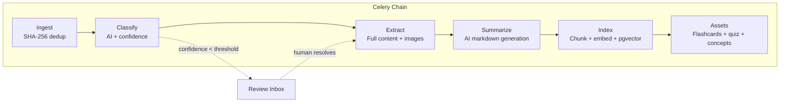
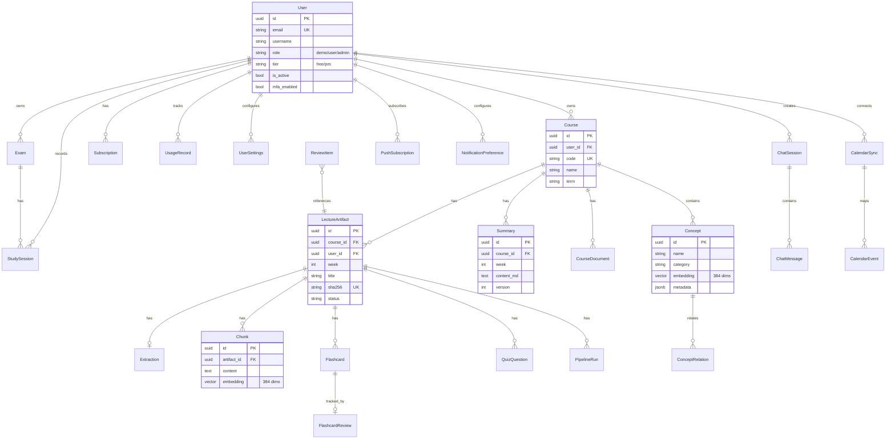
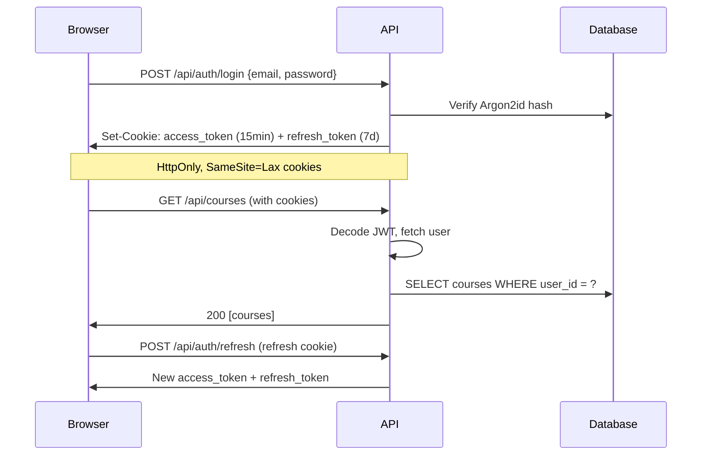

# StudyAIO Architecture

## Overview

StudyAIO follows a **modular monolith** architecture. A single Python codebase runs as both the FastAPI web server and the Celery worker. Internal boundaries are enforced by module structure, not separate deployments.

**v2 stats:** 39 models, 137 API endpoints, 20 frontend pages, 1942 tests (1484 backend + 394 frontend unit + 64 E2E).

## System Diagram (v2)

```mermaid
graph TB
    subgraph "Client (Browser)"
        UI[React SPA<br/>Vite + Tailwind + React Query<br/>PWA + Offline Support]
    end

    subgraph "Docker Compose"
        subgraph "Application"
            API[FastAPI<br/>REST API + SSE + WebPush]
            Worker[Celery Worker<br/>Pipeline Tasks + Beat Scheduler]
        end

        subgraph "Data Stores"
            DB[(PostgreSQL 16<br/>+ pgvector)]
            Redis[(Redis 7<br/>Task Queue + Pub/Sub)]
        end

        subgraph "Reverse Proxy (prod)"
            RP[Traefik v3 / ALB<br/>TLS + Let's Encrypt]
        end
    end

    subgraph "AI Layer (Multi-Provider)"
        Claude[Claude Code CLI]
        Anthropic[Anthropic API]
        OpenAI[OpenAI API]
        Ollama[Ollama (local)]
    end

    subgraph "Embedding Providers"
        ST[sentence-transformers]
        OAIEmb[OpenAI Embeddings]
        OllamaEmb[Ollama Embeddings]
    end

    subgraph "Storage"
        Local[Local Filesystem]
        S3[AWS S3 / S3-compatible]
    end

    subgraph "External Services"
        Stripe[Stripe Billing]
        GCal[Google Calendar]
        Telegram[Telegram Bot]
    end

    UI -- "REST + SSE" --> RP
    RP --> API
    API -- "SQLAlchemy async" --> DB
    API -- "Pub/Sub" --> Redis
    Worker -- "Celery tasks" --> Redis
    Worker -- "SQLAlchemy async" --> DB
    Worker -- "AgentAdapter" --> Claude
    Worker -- "AgentAdapter" --> Anthropic
    Worker -- "AgentAdapter" --> OpenAI
    Worker -- "AgentAdapter" --> Ollama
    Worker -- "EmbeddingProvider" --> ST
    Worker -- "StorageBackend" --> Local
    Worker -- "StorageBackend" --> S3
    API -- "Stripe SDK" --> Stripe
    Worker -- "gcal_service" --> GCal
    API -- "push_service" --> Telegram
```

## Module Boundaries

```
app/
├── api/             # Thin controllers (22 routers): validate → call service → respond
├── agents/          # AgentAdapter ABC + 4 implementations + EmbeddingProvider
├── extractors/      # File parsers: PDF, DOCX, PPTX → ExtractionResult
├── models/          # 38 SQLAlchemy ORM models (data containers only)
├── pipeline/        # 6 Celery tasks: each stage independently retryable
├── services/        # Business logic: stateless functions receiving db sessions
└── core/            # Shared: database, config, exceptions, storage, rate limiting
```

**Key rules:**
- API routes never contain business logic — they delegate to services
- Celery tasks never contain business logic — they delegate to services/agents
- Models are data containers — no methods beyond ORM mapping
- Services are stateless — they receive database sessions as parameters
- All AI calls go through `AgentAdapter` — never call providers directly
- All file I/O goes through `StorageBackend` — never use raw filesystem paths

## Pipeline Architecture

The processing pipeline is a Celery chain of 6 stages. Each stage is a separate task that can be retried independently.



### Stage Details

| Stage | Task | Input | Output | Idempotent? |
|-------|------|-------|--------|-------------|
| 0: Ingest | `ingest_file` | File path + artifact_id | LectureArtifact | Yes (adopts the artifact the upload endpoint created; SHA-256 dedup when called without one) |
| 1: Classify | `classify_artifact` | artifact_id | Updated artifact | Yes (re-classify overwrites) |
| 2: Extract | `extract_artifact` | artifact_id | Extraction record | Yes (skip if exists) |
| 3: Summarize | `summarize_artifact` | artifact_id | Summary record | Yes (version increment) |
| 4: Index | `index_artifact` | artifact_id | Chunk records | Yes (stable IDs, upsert) |
| 5: Assets | `generate_assets` | artifact_id | Flashcards + quizzes + concepts | Yes (delete + re-insert) |

### Chain Compatibility

Each task accepts `str | dict` input. Dict inputs from previous stages carry status flags (`duplicate`, `waiting_review`, `failed`) that cause downstream tasks to skip without error. Pipeline user_id is threaded through dict payloads for multi-tenant isolation.

## Data Model (v2 — 39 models)

The diagram below covers the 22 entities that carry the core relationships. The
remaining 17 are leaf or join tables that hang off `User`: `OAuthAccount`,
`MagicLink`, `Extraction`, `ReviewItem`, `FlashcardReview`, `QuizAttempt`,
`Assessment`, `Deadline`, `Achievement`, `UserAchievement`, `DailyChallenge`,
`UserDailyChallenge`, `UserXP`, `XPEvent`, `Notification`, `TelegramLink`,
`AnalyticsSnapshot`.



### All 38 Models

Core: `User`, `OAuthAccount`, `MagicLink`, `Course`, `LectureArtifact`, `Extraction`, `Summary`, `Chunk`, `Flashcard`, `FlashcardReview`, `QuizQuestion`, `ReviewItem`, `PipelineRun`

Study: `Exam`, `StudySession`, `CourseDocument`

Gamification: `XPEvent`, `Achievement`, `UserAchievement`, `DailyChallenge`, `UserChallenge`

Social: `ChatSession`, `ChatMessage`, `NotificationPreference`, `TelegramLink`, `PushSubscription`

Analytics: `AnalyticsSnapshot`

Billing: `Subscription`, `UsageRecord`, `UserSettings`

Knowledge: `Concept`, `ConceptRelation`

Calendar: `CalendarSync`, `CalendarEvent`

## Authentication & Authorization



- **Self-hosted mode** (`self_hosted=True`): Auth bypassed, default admin user auto-used
- **SaaS mode**: Full JWT auth with Argon2id hashing, optional TOTP MFA, OAuth (Google/GitHub), magic links
- **Role-based access**: `demo`, `user`, `admin` — enforced via `require_role()` dependency
- **Plan-based quotas**: `free`, `pro` — enforced via `require_plan()` dependency

## AI Integration (Multi-Provider)

### Agent Adapter Pattern

All AI interactions go through the `AgentAdapter` abstract base class:

```
AgentAdapter (ABC)
├── classify_lecture() → ClassificationResult
├── generate_summary() → SummaryResult
├── answer_question() → str
├── generate_flashcards() → list[FlashcardData]
├── generate_quiz() → list[QuizQuestionData]
├── extract_concepts() → ConceptExtractionResult
└── stream_answer() → AsyncGenerator[str]
```

**4 implementations:**
| Backend | Module | Notes |
|---------|--------|-------|
| `claude_code` | `agents/claude_code.py` | Shell subprocess to `claude -p` |
| `anthropic_api` | `agents/anthropic_api.py` | Direct Anthropic SDK, native streaming |
| `openai` | `agents/openai_adapter.py` | OpenAI SDK, compatible with any OpenAI-API provider |
| `ollama` | `agents/ollama_adapter.py` | Local Ollama instance |

Selected via `ai_backend` setting. Factory in `agents/factory.py`.

### Embedding Provider

Separate interface (`EmbeddingProvider`) from the agent adapter since embeddings are deterministic:

| Backend | Module | Notes |
|---------|--------|-------|
| `sentence_transformers` | `agents/embeddings.py` | all-MiniLM-L6-v2, 384 dims, in-process |
| `openai` | `agents/openai_embedding.py` | text-embedding-3-small |
| `ollama` | `agents/ollama_embedding.py` | Local Ollama embedding model |

Selected via `embedding_backend` setting.

## Storage Backend

All file I/O uses the `StorageBackend` ABC (`core/storage.py`):

| Backend | Class | Notes |
|---------|-------|-------|
| `local` | `LocalStorageBackend` | Default. Wraps pathlib, files in `data/` volume |
| `s3` | `S3StorageBackend` | AWS S3 or S3-compatible (MinIO). Lazy boto3 client |

DB stores relative keys (e.g., `uploads/abc_file.pdf`), never absolute paths. `normalize_storage_key()` strips prefix. Pipeline stages: local operates directly; S3 downloads to tempdir, processes, uploads results.

## Frontend Architecture

React SPA with route-level code splitting:
- **React.lazy()** for all 20 page components (per-route chunks)
- **React Query** for server state (cache, dedup, background refresh)
- **React Router** for navigation (20 pages)
- **SSE** for real-time pipeline progress and chat streaming
- **Tailwind CSS v4** with CSS custom properties for theming (light/dark)
- **PWA** with Workbox service worker, offline queue (IndexedDB), install prompt
- **Radix UI** primitives for accessible dialogs, tabs, tooltips, dropdowns
- **Motion** (Framer Motion) for page transitions and animations
- **D3** for knowledge graph visualization
- **Recharts** for analytics charts

No global state management — all server state lives in React Query's cache. Local UI state via useState/useReducer.

## Deployment Topologies

### Self-Hosted (Docker Compose)
```
Traefik → UI (nginx) + API (FastAPI) + Worker (Celery) + DB + Redis
```
TLS via Let's Encrypt. Single `docker-compose.selfhosted.yml`.

### AWS Cloud (ECS Fargate)
```
ALB → ECS (API + Worker) → RDS (PostgreSQL) + ElastiCache (Redis) + S3
```
Terraform in `infra/cloud/aws/`. CI/CD via GitHub Actions → GHCR → ECS deploy.

### Development
```
docker compose up -d
```
Bind-mount source for hot reload. Exposed ports: API 8000, UI 3001, DB 5433, Redis 6380.

## Key Design Decisions

| Decision | Rationale |
|----------|-----------|
| Modular monolith over microservices | Single codebase reduces operational complexity; clear module boundaries provide the same separation of concerns |
| Celery chains over sequential execution | Independent retry per stage, non-blocking, observable via pipeline run records |
| Review inbox over blocking prompts | Low-confidence results don't block the pipeline for other files |
| Multi-provider AI adapters | User choice between Claude, OpenAI, Ollama; same interface, swappable at runtime |
| pgvector over dedicated vector DB | Fewer services to manage; PostgreSQL is already the source of truth |
| Agent adapter pattern | Decouples pipeline from any specific AI provider |
| StorageBackend ABC | Local dev and cloud S3 use same code paths; no filesystem assumptions |
| HttpOnly cookies over Bearer tokens | Immune to XSS token theft; auto-refresh via 401 interceptor |
| Self-hosted default | Zero auth friction for single-user deployments; full SaaS auth when needed |
| Route-level code splitting | Reduces initial bundle size; heavy vendors (D3, PDF viewer) only loaded when needed |
