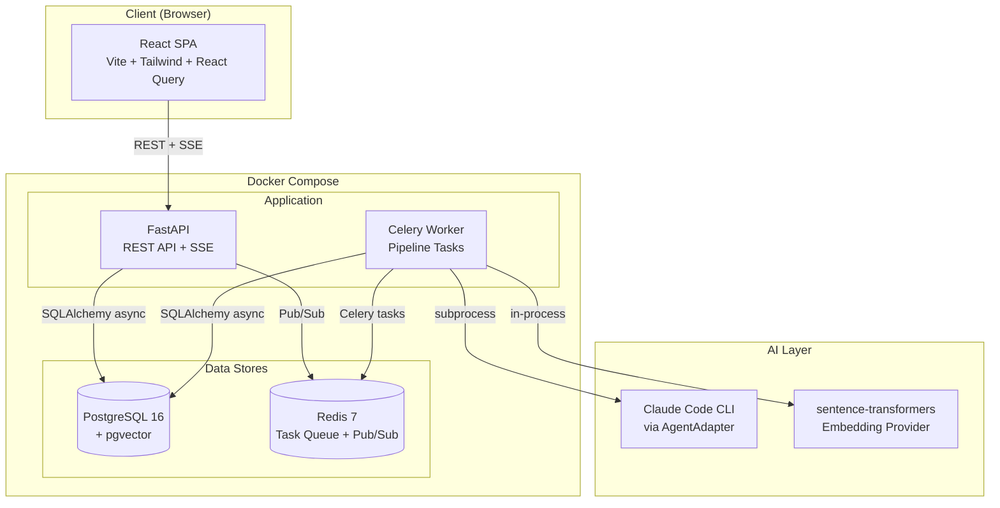
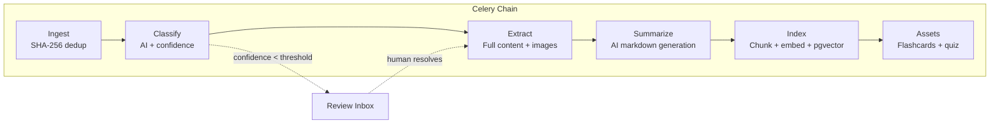
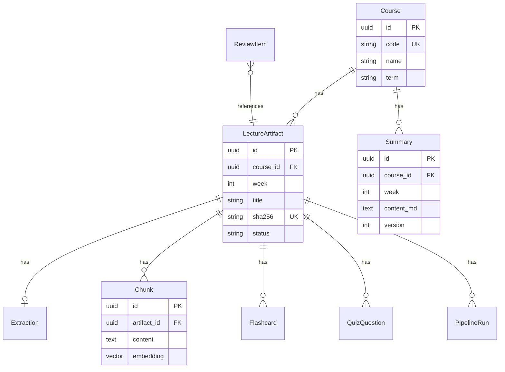

# StudyAIO Architecture

## Overview

StudyAIO follows a **modular monolith** architecture. A single Python codebase runs as both the FastAPI web server and the Celery worker. Internal boundaries are enforced by module structure, not separate deployments.

## System Diagram



## Module Boundaries

```
app/
├── api/             # Thin controllers: validate → call service → respond
├── agents/          # AgentAdapter ABC + implementations (Claude, embeddings)
├── extractors/      # File parsers: PDF, DOCX, PPTX → ExtractionResult
├── models/          # SQLAlchemy ORM models (data containers only)
├── pipeline/        # Celery tasks: each stage is independently retryable
├── services/        # Business logic: stateless functions receiving db sessions
└── core/            # Shared: database, config, exceptions, utilities
```

**Key rules:**
- API routes never contain business logic — they delegate to services
- Celery tasks never contain business logic — they delegate to services/agents
- Models are data containers — no methods beyond ORM mapping
- Services are stateless — they receive database sessions as parameters
- All AI calls go through `AgentAdapter` — never call Claude directly

## Pipeline Architecture

The processing pipeline is a Celery chain of 6 stages. Each stage is a separate task that can be retried independently.



### Stage Details

| Stage | Task | Input | Output | Idempotent? |
|-------|------|-------|--------|-------------|
| 0: Ingest | `ingest_file` | File path | LectureArtifact | Yes (SHA-256 dedup) |
| 1: Classify | `classify_artifact` | artifact_id | Updated artifact | Yes (re-classify overwrites) |
| 2: Extract | `extract_artifact` | artifact_id | Extraction record | Yes (skip if exists) |
| 3: Summarize | `summarize_artifact` | artifact_id | Summary record | Yes (version increment) |
| 4: Index | `index_artifact` | artifact_id | Chunk records | Yes (stable IDs, upsert) |
| 5: Assets | `generate_assets` | artifact_id | Flashcards + quizzes | Yes (delete + re-insert) |

### Chain Compatibility

Each task accepts `str | dict` input. Dict inputs from previous stages carry status flags (`duplicate`, `waiting_review`, `failed`) that cause downstream tasks to skip without error.

## Data Model



## AI Integration

### Agent Adapter Pattern

All AI interactions go through the `AgentAdapter` abstract base class:

```
AgentAdapter (ABC)
├── classify_lecture() → ClassificationResult
├── generate_summary() → SummaryResult
├── answer_question() → str
├── generate_flashcards() → list[FlashcardData]
└── generate_quiz() → list[QuizQuestionData]
```

**v1 implementation:** `ClaudeCodeAdapter` shells out to `claude -p` via `asyncio.create_subprocess_exec`. The adapter is injected via factory function, making it swappable.

### Embedding Provider

Embeddings use a separate interface (`EmbeddingProvider`) from the agent adapter since embeddings are deterministic, not generative. v1 uses `SentenceTransformerProvider` (all-MiniLM-L6-v2, 384 dimensions) running in-process.

## Frontend Architecture

React SPA with:
- **React Query** for server state (cache, dedup, background refresh)
- **React Router** for navigation (6 pages)
- **SSE (EventSource)** for real-time pipeline progress
- **Tailwind CSS v4** for styling

No global state management — all server state lives in React Query's cache.

## Key Design Decisions

| Decision | Rationale |
|----------|-----------|
| Modular monolith over microservices | Single codebase reduces operational complexity; clear module boundaries provide the same separation of concerns |
| Celery chains over sequential execution | Independent retry per stage, non-blocking, observable via pipeline run records |
| Review inbox over blocking prompts | Low-confidence results don't block the pipeline for other files |
| Local embeddings over API | No API keys or costs; the ABC allows swapping in OpenAI/Voyage later |
| pgvector over dedicated vector DB | Fewer services to manage; PostgreSQL is already the source of truth |
| Agent adapter pattern | Decouples pipeline from any specific AI provider; v2 could swap in direct API calls |
